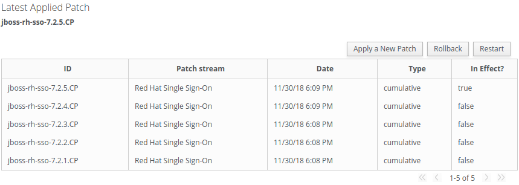

Ansible role: "Red Hat Single Sign-On"
=================================


Description
-----------

Advanced Ansible role that manages [Red Hat Single Sign-On](https://access.redhat.com/products/red-hat-single-sign-on) instances.

Core implemented features in this role:

- dependencies installation
- red hat subscription manager
- multiple parallel versions and profile support
- download and patches apply
- jvm configuration
- configuration of the Red Hat JBoss EAP instances using the CLI
- cleanup after installation



This role is based on:

- https://github.com/Maarc/ansible_middleware_soe showing how to easily operate Red Hat JBoss middleware products using ansible role.
- https://github.com/Maarc/ansible-role-redhat-jboss-eap
- https://github.com/Maarc/ansible-role-redhat-jboss-common
- https://github.com/sabre1041/redhat-csp-download

Requirements
------------

This role has been tested on Ansible 2.7.2. It requires Red Hat Enterprise Linux 7 and a valid subscription.


Dependencies
------------

There are no dependencies.


Installation
------------

1. create a .vault with your secret.

2. create the file vars/rhn_credentials.yml with the following content of your redhat account. Example:

```
rhn_username: us3r
rhn_password: p@ss
rhn_poolid: a1b2-c3d4-e5f6-g7h8-i9j0k
```

3. encrypt the file:

```
ansible-vault encrypt vars/rhn_credentials.yml --vault-password-file=.vault
```

Execution
---------

`ansible-playbook playbook.yml -vvv -k --vault-password-file roles/ansible-role-redhat-single-sign-on/.vault --flush-cache`

Role Variables
--------------

*Global configurations*

| Name              | Default Value       | Description          |
|-------------------|---------------------|----------------------|
| `role_id` | `ansible-role-redhat-single-sign-on` | Name of the role after download |
| `ansible_roles_path` | `/etc/ansible/playbooks/roles` | Ansible roles directory |
| `subtasks_directory_path` | `tasks/subtasks` | Role subtasks directory |
| `binaries_directory_path` | `files` | Role binaries directory (for additional modules) |


*Red Hat Single Sign-On configurations*

| Name              | Default Value       | Description          |
|-------------------|---------------------|----------------------|
| `rhsso_artifact_version` | `7.2.0` | ID of base release of Red Hat Single Sign-On |
| `rhsso_artifact_url` | `https://access.redhat.com/jbossnetwork/restricted/softwareDownload.html?softwareId=55951&product=core.service.rhsso` | Download URL for Red Hat Single Sign-On |
| `rhsso_artifact_name` | `rh-sso-{{ rhsso_artifact_version }}.zip` | Generated name of Red Hat Single Sign-On zip artifact |
| `rhsso_artifact_checksums` | `Object.array(id, checksum)` | Dict [key:id, value:checksum] of red hat single sign-on base releases |


*Red Hat Single Sign-On patches*

| Name              | Default Value       | Description          |
|-------------------|---------------------|----------------------|
| `rhsso_apply_patches` | `true` | Conditional for installing red hat single sign-on patches |
| `rhsso_patches` | `Object.array(id, url, filename, sha256checksum)` | Dict [id, url, filename, sha256checksum] of red hat single sign-on patches releases |


*Red Hat Single Sign-On configurations*

| Name              | Default Value       | Description          |
|-------------------|---------------------|----------------------|
| `general.install_dir` | `/usr/share` | Red Hat Single Sign-On installation directory |
| `general.home_dir_name` | `rh-sso-7.2` | Red Hat Single Sign-On home name |
| `general.instance_name` | `rh-sso` | Red Hat Single Sign-On service name |
| `general.download_dir` | `/tmp` | Temporary folder for Red Hat Single Sign-On downloads |
| `jboss.console_admin_user` | `jboss` | JBoss EAP admin console user |
| `jboss.console_admin_password` | `jboss@123` | JBoss EAP admin console password |
| `jboss.jgroups_user` | `jbservice` | JBoss EAP jgroups cluster user |
| `jboss.jgroups_password` | `jbservice` | JBoss EAP jgroups cluster user password |
| `jboss.keycloak_user` | `admin` | Keycloak admin user |
| `jboss.keycloak_password` | `jboss@123` | Keycloak admin user password |
| `jboss.host_type` | `master` | Jboss EAP host type: (master | slave) |
| `jboss.domain_master_address` | `` | Jboss EAP domain master ipv4 address |
| `owner.user` | `` | Red Hat Single Sign-On RHEL user |
| `owner.group` | `` | Red Hat Single Sign-On RHEL user group |
| `owner.group_id` | `` | Red Hat Single Sign-On RHEL user group id |


*System configurations*

| Name              | Default Value       | Description          |
|-------------------|---------------------|----------------------|
| `config.install_java` | `true` | Conditional for installing jvm |
| `config.install_rhsm` | `true` | Conditional for subscribing to Red Hat Subscription Manager |
| `config.install_jdbc_oracle` | `true` | Conditional for installing Oracle DBMS module (files/ojdb8.jar) |
| `config.timezone_main` | `America/Sao_Paulo` | JBoss EAP timezone |
| `config.timezone_language` | `pt` | JBoss EAP timezone language |
| `config.timezone_country` | `BR` | JBoss EAP timezone country |


*JVM configurations*

| Name              | Default Value       | Description          |
|-------------------|---------------------|----------------------|
| `jvm_pkg_name` | `java-1.8.0-openjdk-devel` | Name of JVM package to be installed |
| `jvm_java_opts` | `` | Additional JVM opts (see tasks/03__download_and_install.yml) |
| `jvm_xmx` | `1024M` | -Xmx |
| `jvm_xms` | `1024M` | -Xms |
| `compressedClassSpaceSize` | `512M` | -XX:CompressedClassSpaceSize |
| `metaspaceSize` | `256M` | -XX:MetaspaceSize |
| `maxMetaspaceSize` | `512M` | -XX:MaxMetaspaceSize |


*Usage of CLI files for the JBoss EAP configuration*

| Name              | Default Value       | Description          |
|-------------------|---------------------|----------------------|
| `cli_list` | `{ }` | List of CLI files to be used for the configuration |
| `cli_dir` | empty | Local directory containing the CLI files in cli_list. Mandatory if `cli_list` is not empty |


Example Playbook
----------------

Here is a playbook creating two JBoss EAP instances on every host in "jboss-master" and "jboss-slave":

    ---
    - name: install and configure Red Hat Single Sign-On master
      hosts: host-master
      remote_user: root
      vars:
        role_id: ansible-role-redhat-single-sign-on
        ansible_roles_path: /etc/ansible/playbooks/roles
        rhsso_apply_patches: true
        jboss:
          console_admin_user: jboss
          console_admin_password: jboss@123
          jgroups_user: jbservice
          jgroups_password: jboss@123
          keycloak_user: admin
          keycloak_password: jboss@123
          host_type: master
        config:
          install_java: true
          install_rhsm: true
          install_jdbc_oracle: true
          timezone_main: "America/Sao_Paulo"
          timezone_language: pt
          timezone_country: BR
        jvm_xmx: "1024M"
        jvm_xms: "1024M"
        compressedClassSpaceSize: "512M"
        metaspaceSize: "256M"
        maxMetaspaceSize: "512M"
      roles:
        - { role: ansible-role-redhat-single-sign-on }
                                                                     
    - name: install and configure Red Hat Single Sign-On slave
      hosts: host-slave
      remote_user: root
      vars:
        role_id: ansible-role-redhat-single-sign-on
        ansible_roles_path: /etc/ansible/playbooks/roles
        rhsso_apply_patches: true
        jboss:
          console_admin_user: jboss
          console_admin_password: jboss@123
          jgroups_user: jbservice
          jgroups_password: jboss@123
          keycloak_user: admin
          keycloak_password: jboss@123
          host_type: master
          domain_master_address: "192.168.10.81"
        config:
          install_java: true
          install_rhsm: true
          install_jdbc_oracle: true
          timezone_main: "America/Sao_Paulo"
          timezone_language: pt
          timezone_country: BR
        jvm_xmx: "1024M"
        jvm_xms: "1024M"
        compressedClassSpaceSize: "512M"
        metaspaceSize: "256M"
        maxMetaspaceSize: "512M"
      roles:
        - { role: ansible-role-redhat-single-sign-on }

Structure
---------

- `defaults/main.yml` centralize the default variables that could be overridden
- `tasks/main.yml` coordinate the execution of the different tasks
- `tasks/00__check_required_variables.yml` validate required variables to be set.
- `tasks/01__subscribe_rhsm.yml` subscribe the host using Red Hat Subscription Manager (requires a valid user account and pool-id).
- `tasks/02__install_dependencies.yml` install required tools like python, lsof and nmap
- `tasks/03__download_and_install.yml` perform the Red Hat Single Sign-On download and configuration
- `tasks/04__download_patches_and_checksum.yml` perform the Red Hat Single Sign-On patches download and checksum
- `tasks/05__apply_patches.yml` perform the Red Hat Single Sign-On patches installation
- `tasks/06__execute_cli_files.yml` perform the Red Hat Single Sign-On additional cli files installation (TODO)
- `tasks/07__clean_up.yml` perform clean up of the environment
- `tasks/08__start_servers.yml` perform servers startup
- `vars/main.yml` centralize some convenience variables that should not be overridden

License
-------

[Apache 2.0](./LICENSE)


Author Information
------------------

* [Raphael Abreu](https://github.com/aelkz)